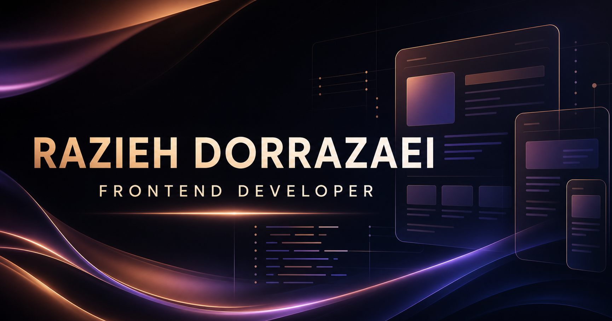

# Razieh.dev Portfolio

An accessible, responsive one-page portfolio for frontend developer Razieh Dorrazaei. It presents selected work, technical strengths, development process, contact links, and a downloadable CV.



## Features

- responsive one-page layout
- click-to-enter intro screen with direct-link bypass
- smooth, brisk first-name and surname entrance with 3D settling and a subtle shine
- matching text-free cinematic background derived from the intro artwork
- four selected works with Holo Mini in the final position
- complete five-project archive with explicit published and source-only labels
- Holo Mini screenshot with direct live and GitHub links
- downloadable three-page CV
- keyboard-visible focus states and skip navigation
- reduced-motion support
- responsive public asset paths for root or subpath deployment
- automated component tests
- Open Graph and favicon metadata

## Tech stack

- React 19
- TypeScript
- Vite 8
- classic CSS with custom properties
- Lucide React icons
- Vitest and React Testing Library
- ESLint

## Getting started

Requirements: a current Node.js LTS release and npm.

```bash
npm install
npm run dev
```

Vite prints the local development URL after startup.

## Quality commands

```bash
npm test
npm run lint
npm run build
npm run preview
```

| Command | Purpose |
| --- | --- |
| `npm run dev` | Start the development server |
| `npm test` | Run all component tests once |
| `npm run test:watch` | Run tests in watch mode |
| `npm run lint` | Check TypeScript and TSX files with ESLint |
| `npm run build` | Type-check and create the production bundle |
| `npm run preview` | Serve the production bundle locally |

## Project structure

```text
public/
├── holomini-home.png
└── updated-CV.pdf
src/
├── components/
│   ├── layout/
│   └── projects/
├── data/
│   ├── portfolio.ts
│   └── projects.ts
├── sections/
├── test/
├── App.css
├── App.tsx
└── main.tsx
```

Portfolio content is maintained in `src/data`. Page sections receive this data through typed props, and `App.tsx` only composes the page.

## Projects

The selected work section currently presents Lifestyle Quiz, Glowify, AutoFlow Workshop, and Holo Mini in that order. The complete archive also includes the GitHub-only Raaji Baluch Blog project.

Published projects expose their live website and source repository. Source-only projects show a GitHub action without an empty or misleading live button.

Add or update projects in `src/data/projects.ts`. Optional images belong in `public/` and need a meaningful `imageAlt` value.

## Deployment

Create the production output in `dist/`:

```bash
npm run build
```

The app can be deployed to GitHub Pages, Netlify, Vercel, or another static host. It currently uses Vite's default root base (`/`). If the final host serves the site under a repository subpath, set `base` in `vite.config.ts` before deployment. Public image and CV URLs already use `import.meta.env.BASE_URL`.

The final public URL is intentionally not documented yet because the hosting target has not been selected.

## Accessibility and responsive checks

The implementation includes one `h1`, labelled regions, safe external links, a skip link, visible keyboard focus, 44 px touch targets for important controls, and reduced-motion handling. The production preview should still be checked manually with keyboard navigation and on a real mobile device before release.

## Project documentation

- [spec.md](./spec.md): product and technical requirements
- [AUDIT.md](./AUDIT.md): phase-by-phase completion record
- [AGENTS.md](./AGENTS.md): development rules

## Contact

- [GitHub](https://github.com/razidorra)
- [LinkedIn](https://linkedin.com/in/Razidorra)
- [Email](mailto:dorra.razi@gmail.com)
